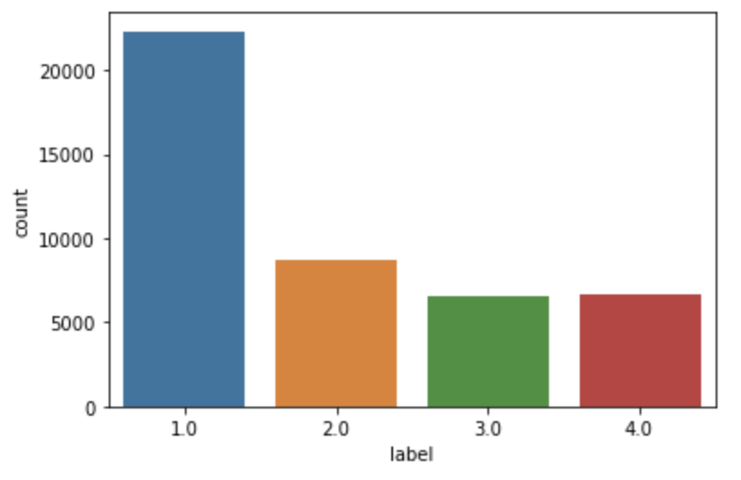

# Predict Offer Completion on Starbucks App

For this project, I revisited [an earlier project](https://github.com/jasonsuk/ds-starbucks) that I completed about a year ago, to revise codes, analysis and modeling workflow.

Details including project description and results can be found below.

## Table of contents

1. [Project motivation](#motivation)
2. [Terminology](#terminology)
3. [Results](#results)
4. [File description](#files)
5. [Licensing, Authors, Acknowledgement](#others)

 

## 1. Project motivation

In this project, I would like to

1. explore how customers interact with offers sent by Starbucks
2. build a machine learning classifier to predict if an offer will be completed by a customer, given offer type, channels distributed and customer demogrpahics.

The primary business objective is to save time and marketing costs involved in promotional activities on Starbucks App. Ultimately, I want the model to improve customer experience and business performance by sending the right offer to the right customers and increasing offer completion rate.

 

## 2. Terminology

In total 5 labels are specified as below. Label 1 is when an offer was completed while Label 2-4 represents incomplete offers in more granular level.

Label 5 is assigned to data records that offers were not sent by the company. As unsent offers do not describe customer behaviours at all. Therefore,
they are excluded for the actual training.

1. complete
2. inactive : incomplete, no purchase after offer viewed
3. active : incomplete, but purchased without offer viewed
4. indifferent: incomplete, no purchase no view
5. not received (= unsent offer)

Before the training, label imbalance issue was found as the below chart depicts. Almost half the training data points to label 1, which would likely to cause classification biased toward the specific label.

    

Therefore to overcome this issue, oversampling technique was applied to make each label size identical, using Python module **imblearn**.

 

## 3. Results

The training was performed using 5 machine learning classifiers. It turns that **Random forest** worked the best providing 77% test accuracy.

|               Model               | Logistic  Regression | Decision  Tree | Random  Forecast | Gradient  Boosting | XGboost |
| :-------------------------------: | :---------------------: | :---------------: | :-----------------: | :-------------------: | :-----: |
| Train accuracy  - oversampled  |           81%           |        86%        |         86%         |          85%          |   99%   |
|  Test accuracy  - oversampled  |           73%           |        76%        |       **77%**       |        **77%**        | **77%** |
| Train accuracy  - undersampled |           78%           |        84%        |         84%         |          80%          |   80%   |
| Test accuracy  - undersampled  |           69%           |        67%        |         67%         |          68%          |   68%   |

After a parameter tuning, the final model was trained and produced classification score as below.

Although the test accuracy is limited to 77%. F1-scores for label 1 (complete) and label 2 (incomplete - no purchase after offer viewed) are 82%, 89% respectively. As the business objective is to predict the offer completion, the result is promising.

It is in fact label 3 and 4 that the model classifies poorly. Presumably more dataset might be able to improve the model performances in the future, and then it will provide a more granular analyis on why a certain offer was not imcomplete.

**TRAIN** Accuracy score: 99.63%
 Classfication report:

              precision    recall  f1-score   support

         1.0       0.99      1.00      0.99     22305
         2.0       1.00      1.00      1.00     22305
         3.0       1.00      0.99      0.99     22305
         4.0       1.00      1.00      1.00     22305

    accuracy                           1.00     89220

    macro avg 1.00 1.00 1.00 89220
    weighted avg 1.00 1.00 1.00 89220

**TEST** Accuracy score: 77.04%  
Classfication report:

              precision    recall  f1-score   support

         1.0       0.80      0.84      0.82      5573
         2.0       0.89      0.88      0.89      2203
         3.0       0.56      0.49      0.52      1606
         4.0       0.68      0.65      0.67      1663

    accuracy                           0.77     11045

    macro avg 0.73 0.72 0.72 11045
    weighted avg 0.77 0.77 0.77 11045

 

## 4. File description

The project has a file structure as following

    ____data
    |   |__original : json files that contain the original raw data
    |___assets      : image files used for README.md
    |___models      : folder to save the models
    |___wrangling.ipynb
    |___analysis.ipynb

The main notebooks are divided into two by the objective to achieve:

- **wrangling.ipynb** : load, clean and manipulate the dataset ready for analysis
- **analysis.ipynb** : perform exploratory analysis and build classification models (through additional preprocessing and feature engineering)

Therefore, analysis.ipynb continues with the datasets cleaned through the processes that can be found in wrangling.ipynb.

Due to 100MB file size limit, the clean dataset and the models were excluded on the github. When running the cells on the notebooks, the files will be added.

 

## 5. Licensing, Authors, Acknowledgement

This capstone project is designed by [Udacity](https://www.udacity.com/course/data-scientist-nanodegree--nd025). The dataset were initially provided by the course provider. However, the choice of the business questions, data analysis, machine learning methods is at the discretion of the project owner.
